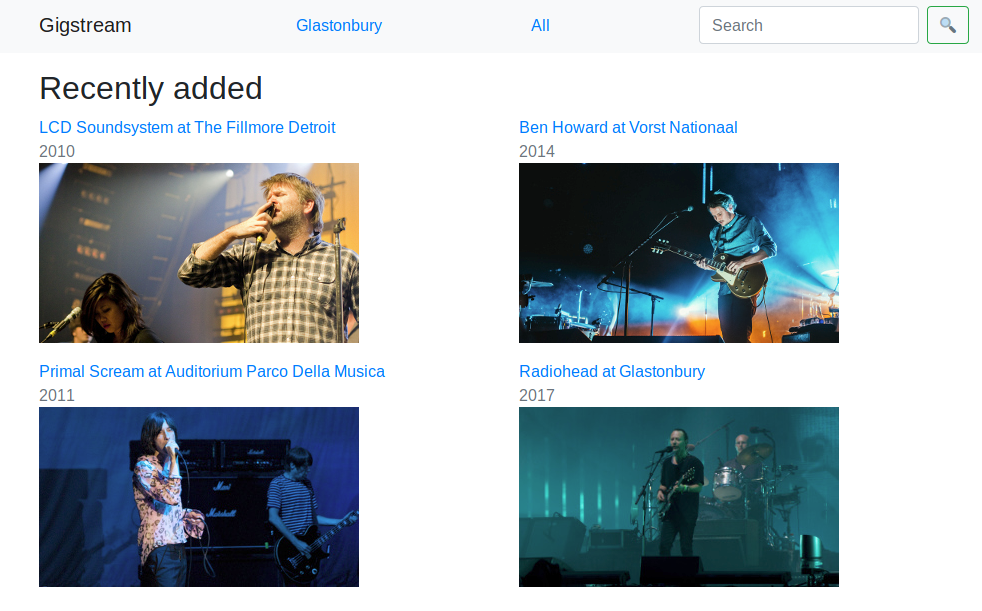

# Gigstream

Web server for streaming gig videos.

## Usage

### Configuration

The Gigstream server will start up pointing at the examples in this repository
by default. Once your gig videos are being served up from somewhere (see
[Video store](#video-store)) you'll need to configure Gigstream to load the
videos from there instead by setting the DATA_URL environment variable.

### Building

Build with maven using `mvn package`

### Running

Run the .jar file in the target directory using
`DATA_URL=YOUR_URL java -jar target/JAR_FILE`

## Video store

Gigstream loads gig videos from a configurable web address. Either host your own
or use an object storage service such as S3.

The files should have a flat directory structure as:
* `gigs.json` - index
* `0_set` - set video with ID 0
* `0_thumb` - set thumbnail with ID 0
* `1_set` - set video with ID 1
* `1_thumb` - set thumbnail with ID 1
* `1_tracks` - set tracklist with ID 1 (optional)
* ...

Look in the [example](example) directory for a rough guide (and to see the
syntax of the index file).

The tracklist file must be in
[WebVTT](https://developer.mozilla.org/en-US/docs/Web/API/WebVTT_API) format.
